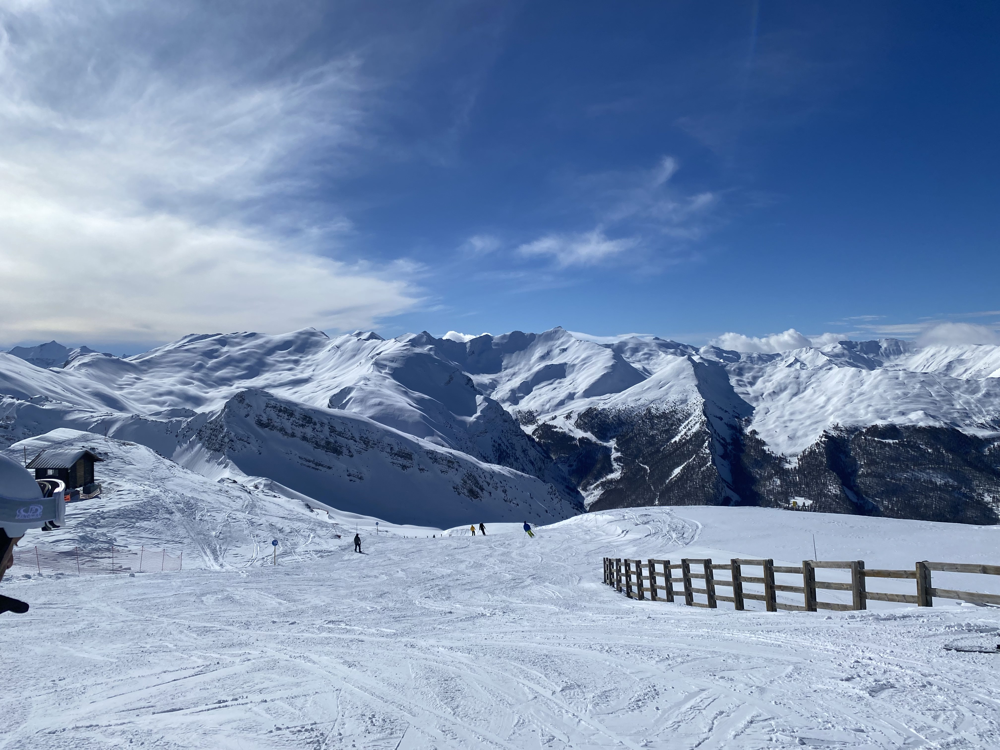

# Skiing

I started skiing at the age of 10 and it quickly became my favourite sport (sadly it's only available for 1/3 of the year). At 16, I starting working as a ski instructor every season and this would continue into my Bachelor's until being interuptted by the pandemic. Having skiied in western Canada most of my life, and with a recent trip to the alps, my next immediate goal is to ski in Japan.

Here's some recent photos from a ski trip in the french alps.

