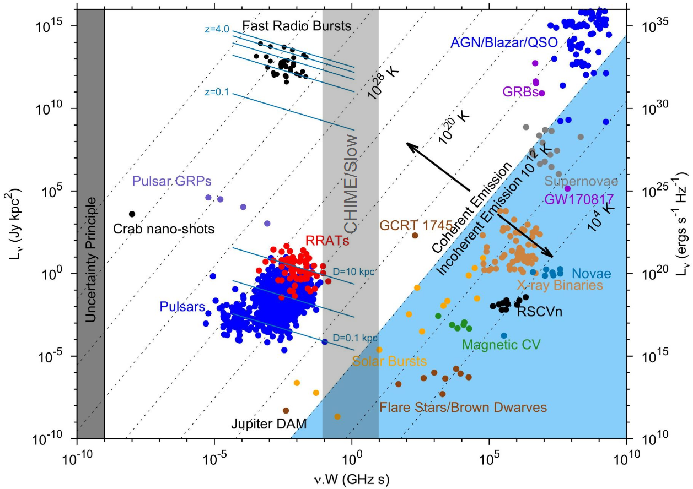

# Research Interests
As part of the [AstroFlash](https://astroflash-frb.github.io/) and [CHIME](https://chime-experiment.ca/en) Collaborations, my research focuses on radio transients; in particular, (repeating) fast radio bursts, pulsars and long-period radio transients.

## Repeating Fast Radio Bursts

Using the Nançay Radio Telescope in France, I study repeating fast radio bursts through the ÉCLAT (Extragalactic Coherent Light from Astrophysical Transients) Campaign. ÉCLAT currently monitors ~20 repeating fast radio burst sources at a weekly-biweekly cadence of ~1 hour exposures at frequencies between 1.1-3.5GHz (mostly between 1.1-1.8GHz). Since the campaign's start in early 2022, >1000 bursts have been detected from over half of the monitored sources. 

Recent publications include:

 - [A Repeating Fast Radio Burst Source in a Low-Luminosity Dwarf Galaxy](https://ui.adsabs.harvard.edu/abs/2024arXiv241017044H/abstract)
 - [A Nançay Radio Telescope study of the hyperactive repeating FRB 20220912A](https://ui.adsabs.harvard.edu/abs/2024MNRAS.534.3331K/abstract)

Additionally a poster made for the Netherlands Astronomers' Conference (NAC) 2024 as an overall summary of results for my Master's Thesis work on repeating fast radio bursts can be found [here](media/NAC 2024 Poster.pdf).

## Slow Radio Transients

<!-- {width=500px}  -->

The CHIME/Slow Survey is a "slow" radio transient survey currently in development aiming to probe the relatively unexplored observational gap of 50 milliseconds ~ 5 seconds. With aimed launch in 2025, CHIME/Slow will be largest and most sensitive survey in this regime, and the only survey of its kind in the northern hemisphere. CHIME/Slow aims to probe the longest timescale and most scattered fast radio bursts, the newly discovered class of long period radio transients and more exotic transients. I am currently facilitating in the launch and future operation and scientific analyses.

## Publications

A full list of publications can be found [here](./all_publications.md).